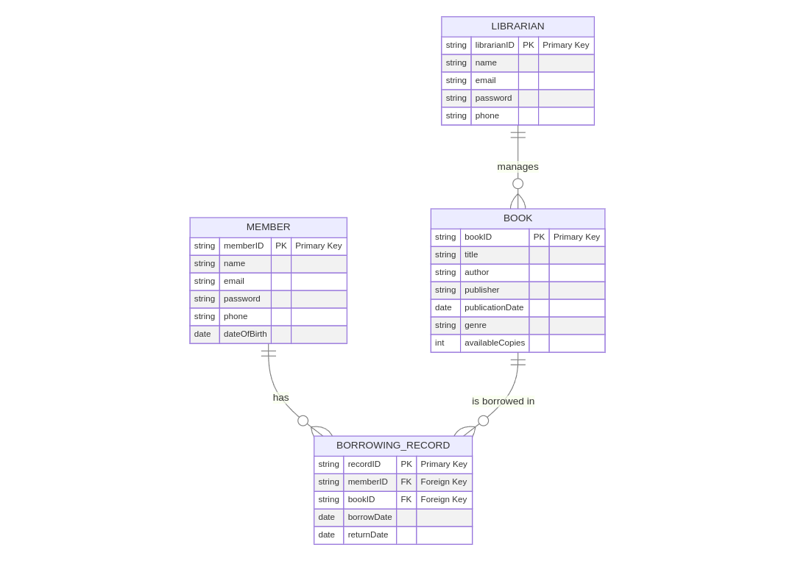

### Library Application Analysis

#### 1. Business Process Description

**Business Process Flow Overview:**

The library application facilitates several core functions: member registration, member login, book registration, book borrowing, and book return. Each of these functions supports the primary goal of managing library resources and member interactions efficiently.

**Level 1 DFD:**

- **Processes:**
  1. **Member Registration Process**: Handles new member sign-ups.
  2. **Member Login Process**: Authenticates existing members.
  3. **Book Registration Process**: Manages addition of new books to the system.
  4. **Book Borrowing Process**: Facilitates the borrowing of books by members.
  5. **Book Return Process**: Handles the return of borrowed books.

- **Data Stores:**
  - **Member Database**
  - **Book Database**
  - **Borrowing Records**

Here's the data flow diagram.


#### Business Flow:

1. **Member Registration:**
   - The member provides personal details.
   - The system validates the details and stores them in the Member Database.
   - Successful registration allows the member to access the library system.

2. **Member Login:**
   - The member submits login credentials.
   - The system verifies these credentials against the Member Database.
   - Successful login grants access to library features like borrowing books.

3. **Book Registration:**
   - The administrator inputs new book details.
   - The system records these details in the Book Database.
   - Books become available for borrowing once registered.

4. **Book Borrowing:**
   - The member requests to borrow a book.
   - The system checks book availability and updates the Borrowing Records.
   - The book status is updated to indicate it is borrowed.

5. **Book Return:**
   - The member submits a return request.
   - The system updates the Borrowing Records to reflect the book's return.
   - The Book Database is updated to indicate the book is available again.


#### 2. Data Structure Description



**Entities and Attributes:**

1. **MEMBER**
   - **memberID**: A unique identifier for each member (Primary Key).
   - **name**: The full name of the member.
   - **email**: The email address of the member.
   - **password**: The password for the member’s account (stored securely).
   - **phone**: The phone number of the member.
   - **dateOfBirth**: The date of birth of the member.

2. **BOOK**
   - **bookID**: A unique identifier for each book (Primary Key).
   - **title**: The title of the book.
   - **author**: The author of the book.
   - **publisher**: The publisher of the book.
   - **publicationDate**: The date when the book was published.
   - **genre**: The genre/category of the book.
   - **availableCopies**: The number of copies available for borrowing.

3. **BORROWING_RECORD**
   - **recordID**: A unique identifier for each borrowing record (Primary Key).
   - **memberID**: Foreign Key linking to the MEMBER entity.
   - **bookID**: Foreign Key linking to the BOOK entity.
   - **borrowDate**: The date when the book was borrowed.
   - **returnDate**: The date when the book was returned (null if not yet returned).

4. **LIBRARIAN**
   - **librarianID**: A unique identifier for each librarian (Primary Key).
   - **name**: The full name of the librarian.
   - **email**: The email address of the librarian.
   - **password**: The password for the librarian’s account (stored securely).
   - **phone**: The phone number of the librarian.

**Relationships:**

- A **MEMBER** can have multiple **BORROWING_RECORD** entries (one-to-many relationship).
- A **BOOK** can be referenced in multiple **BORROWING_RECORD** entries (one-to-many relationship).
- A **LIBRARIAN** manages multiple **BOOK** entries (one-to-many relationship).


#### 3. Application Mockup

Here's a basic mockup of the library application, divided into the main user interfaces for different roles:

**A. Member Interface**

1. **Home Page**
   - Navigation Menu: Home, Browse Books, My Account, Logout
   - Welcome message and search bar to find books

   ```plaintext
   +-------------------------+
   | Library Application    |
   +-------------------------+
   | Home    | Browse Books | My Account | Logout |
   +-------------------------+
   | Search for books: [__________] [Search Button] |
   +-------------------------+
   | Featured Books:                              |
   | - Book Title 1 by Author                    |
   | - Book Title 2 by Author                    |
   +-------------------------+
   ```

2. **Member Registration Page**
   - Form to input personal details

   ```plaintext
   +-------------------------+
   | Register as a Member    |
   +-------------------------+
   | Name: [__________]      |
   | Email: [__________]     |
   | Password: [__________]  |
   | Phone: [__________]     |
   | Date of Birth: [__/__/____] |
   | [Register Button]       |
   +-------------------------+
   ```

3. **Member Login Page**
   - Form to enter login credentials

   ```plaintext
   +-------------------------+
   | Member Login            |
   +-------------------------+
   | Email: [__________]     |
   | Password: [__________]  |
   | [Login Button]          |
   +-------------------------+
   ```

4. **Browse Books Page**
   - List of books with options to borrow

   ```plaintext
   +-------------------------+
   | Browse Books            |
   +-------------------------+
   | Book Title 1 by Author [Borrow Button] |
   | Book Title 2 by Author [Borrow Button] |
   +-------------------------+
   ```

5. **My Account Page**
   - Displays borrowed books and personal info

   ```plaintext
   +-------------------------+
   | My Account              |
   +-------------------------+
   | Personal Info:          |
   | - Name: [Name]          |
   | - Email: [Email]        |
   | - Phone: [Phone]        |
   +-------------------------+
   | Borrowed Books:         |
   | - Book Title 1 (Due: __/__/____) |
   | - Book Title 2 (Due: __/__/____) |
   +-------------------------+
   ```

**B. Librarian Interface**

1. **Home Page**
   - Navigation Menu: Home, Manage Books, View Records, Logout

   ```plaintext
   +-------------------------+
   | Library Application    |
   +-------------------------+
   | Home    | Manage Books | View Records | Logout |
   +-------------------------+
   ```

2. **Manage Books Page**
   - Form to add or update books

   ```plaintext
   +-------------------------+
   | Manage Books            |
   +-------------------------+
   | Title: [__________]     |
   | Author: [__________]    |
   | Publisher: [__________] |
   | Publication Date: [__/__/____] |
   | Genre: [__________]     |
   | Copies Available: [___] |
   | [Add/Update Button]     |
   +-------------------------+
   ```

3. **View Records Page**
   - List of borrowing records

   ```plaintext
   +-------------------------+
   | View Borrowing Records  |
   +-------------------------+
   | Record ID | Member ID | Book ID | Borrow Date | Return Date |
   | 1         | M001     | B001    | __/__/____   | __/__/____   |
   | 2         | M002     | B002    | __/__/____   | __/__/____   |
   +-------------------------+
   ```

#### 4. Process Explanations

**A. Member Registration Process**
   - **Description**: Allows a new user to create an account with the library system.
   - **Steps**:
     1. Member navigates to the registration page.
     2. Member fills out the registration form with personal details.
     3. The system validates the input and creates a new entry in the `MEMBER` database.
     4. A confirmation message is displayed, and the member is redirected to the login page.

**B. Member Login Process**
   - **Description**: Authenticates a member’s credentials to access their account.
   - **Steps**:
     1. Member navigates to the login page.
     2. Member enters their email and password.
     3. The system verifies the credentials against the `MEMBER` database.
     4. Upon successful authentication, the member is redirected to the home page or their account page.

**C. Book Registration Process (Librarian)**
   - **Description**: Allows a librarian to add or update book information.
   - **Steps**:
     1. Librarian navigates to the manage books page.
     2. Librarian enters book details into the form.
     3. The system updates the `BOOK` database with the new or updated book information.
     4. A confirmation message is displayed.

**D. Book Borrowing Process**
   - **Description**: Allows a member to borrow a book from the library.
   - **Steps**:
     1. Member searches for and selects a book from the browse books page.
     2. Member clicks the borrow button.
     3. The system checks the book’s availability and creates a new entry in the `BORROWING_RECORD` database.
     4. The book’s availability status is updated, and a confirmation is provided.

**E. Book Return Process**
   - **Description**: Allows a member to return a borrowed book.
   - **Steps**:
     1. Member navigates to the book return section.
     2. Member submits a return request for the borrowed book.
     3. The system updates the `BORROWING_RECORD` to reflect the book's return and updates the `BOOK` database to indicate it is available.
     4. A confirmation message is displayed.
